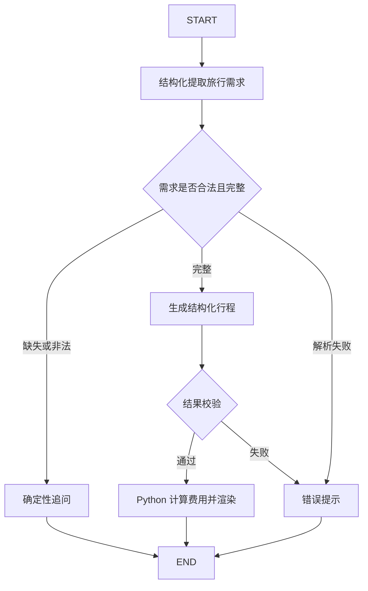
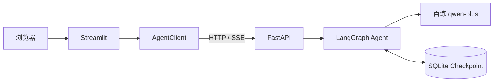

# AgentRoute：基于 LangGraph 的旅行规划助手

新增进阶实现与运行边界：[进阶搭建手册](docs/learning/ADVANCED.md)。地图/MCP、RAG、Celery/Redis、监控默认按配置启用；真实外部服务需各自凭据。

AgentRoute 是一个面向自由行场景的学习型旅行规划 Agent。它把用户自然语言转换为结构化需求，使用确定性规则检查目的地、天数和预算；信息不完整时主动追问，信息完整后生成每日行程，并由 Python 统一计算分类费用总额和预算差额。

项目基于 [JoshuaC215/agent-service-toolkit](https://github.com/JoshuaC215/agent-service-toolkit) 二次开发，保留原项目 MIT 许可和作者归属。

## 功能演示

第一轮：

```text
用户：我想去杭州玩三天。
助手：已收到目的地和天数，请补充每人全程预算，并说明是否包含往返大交通。
```

第二轮使用相同 `thread_id`：

```text
用户：每人1500元，不含往返大交通，喜欢自然风景。
助手：生成三天上午/下午/晚上的参考行程，并展示住宿、餐饮、
      市内交通、门票、其他费用、估算总额和预算差额。
```

非法输入如“0 天、预算 -100 元”会在规则校验阶段被拒绝，不会进入行程生成。

## 核心设计



### 模型负责

- 从多轮用户消息中提取目的地、天数、预算和偏好。
- 按 Pydantic 模型生成每日三个时段和五类费用。

### Python 负责

- 检查目的地非空。
- 限制 1～5 个整数天。
- 限制预算大于 0 且不超过 100 万元。
- 检查日期序列与用户要求完全一致。
- 拒绝包含住宿费的一日游结果。
- 计算费用总额和预算差额。

这种划分让自然语言理解交给模型，把范围、跨字段规则和算术交给可测试的程序逻辑。

## 技术栈

- Python 3.12+
- LangGraph / LangChain
- Pydantic
- FastAPI / Uvicorn
- Streamlit
- SQLite checkpointer
- Docker Compose
- 阿里云百炼 `qwen-plus`（OpenAI 兼容接口）

## 系统架构



- `/invoke` 等工作流结束后返回最终消息。
- `/stream` 通过 SSE 返回 token、完整消息或错误事件。
- `/history` 根据 `thread_id` 恢复聊天记录。
- 远程部署使用 Bearer Token 保护后端接口。
- 百炼 API Key 只注入后端容器。

## 快速开始

### 1. 克隆并创建环境

```bash
git clone https://github.com/Aiyuin/agentroute-travel-planner.git
cd agentroute-travel-planner

conda create -n agentroute python=3.12 pip -y
conda activate agentroute
python -m pip install uv==0.11.32
UV_PROJECT_ENVIRONMENT="$CONDA_PREFIX" uv sync --frozen --python "$CONDA_PREFIX/bin/python"
```

### 2. 配置百炼

复制配置模板：

```bash
cp .env.example .env
```

在 `.env` 中配置以下字段：

```dotenv
DEFAULT_MODEL=openai-compatible
COMPATIBLE_MODEL=qwen-plus
COMPATIBLE_BASE_URL=https://dashscope.aliyuncs.com/compatible-mode/v1
COMPATIBLE_API_KEY=your-bailian-api-key
USE_FAKE_MODEL=false
DATABASE_TYPE=sqlite
SQLITE_DB_PATH=checkpoints.db
HOST=127.0.0.1
PORT=8080
AGENT_URL=http://127.0.0.1:8080
MODE=dev
LANGCHAIN_TRACING_V2=false
LANGFUSE_TRACING=false
```

不要提交 `.env`。它已包含在 `.gitignore` 中。

### 3. 启动后端

```bash
conda activate agentroute
python src/run_service.py
```

### 4. 启动前端

在另一个终端运行：

```bash
conda activate agentroute
python -m streamlit run src/streamlit_app.py \
  --server.address 127.0.0.1 \
  --server.headless true \
  --browser.gatherUsageStats false
```

打开 <http://127.0.0.1:8501>，在 Settings 中选择 `travel-assistant`。

## API 示例

查询服务信息：

```bash
curl http://127.0.0.1:8080/info
```

第一轮：

```bash
curl -X POST http://127.0.0.1:8080/travel-assistant/invoke \
  -H 'Content-Type: application/json' \
  -d '{
    "message": "我想去杭州玩三天",
    "thread_id": "demo-thread"
  }'
```

第二轮：

```bash
curl -X POST http://127.0.0.1:8080/travel-assistant/invoke \
  -H 'Content-Type: application/json' \
  -d '{
    "message": "每人1500元，不含往返大交通，喜欢自然风景",
    "thread_id": "demo-thread"
  }'
```

读取历史：

```bash
curl -X POST http://127.0.0.1:8080/travel-assistant/history \
  -H 'Content-Type: application/json' \
  -d '{"thread_id":"demo-thread"}'
```

## 测试

```bash
conda activate agentroute
python -m pytest tests/agents/test_travel_assistant.py -q
python -m pytest -q
ruff check .
```

当前验证结果：

```text
200 passed, 4 skipped
All checks passed!
```

测试覆盖缺失追问、多轮累计、会话隔离、非法参数、错误天数、一日游住宿费、金额计算和模型失败。

## Docker Compose 部署

轻量部署配置位于 `compose.deploy.yaml`：

- FastAPI 后端仅暴露 Docker 内网端口 8080。
- Streamlit 仅绑定服务器回环地址 `127.0.0.1:8501`。
- SQLite 文件写入 `agent_data` 数据卷。
- 后端与前端分别设置健康检查和内存限制。
- 前端没有百炼 API Key，只持有服务间认证密钥。

准备部署配置：

```bash
cp .env.deploy.example .env.deploy
```

填写专用百炼密钥和随机 `AUTH_SECRET`，然后运行：

```bash
COMPOSE_PARALLEL_LIMIT=1 docker compose \
  --env-file .env.deploy -f compose.deploy.yaml build

docker compose \
  --env-file .env.deploy -f compose.deploy.yaml \
  up -d --wait --wait-timeout 240
```

建议通过 SSH 隧道访问页面，不直接向公网开放 Streamlit：

```bash
export SERVER_IP="your-server-ip"
ssh -N -o ExitOnForwardFailure=yes \
  -L 127.0.0.1:18501:127.0.0.1:8501 \
  root@"$SERVER_IP"
```

随后打开 <http://127.0.0.1:18501>。

## 项目文件

| 文件 | 说明 |
| --- | --- |
| `src/agents/travel_assistant.py` | 旅行状态图与业务规则 |
| `src/agents/agents.py` | Agent 注册表 |
| `src/service/service.py` | FastAPI、SSE、历史接口与鉴权 |
| `src/client/client.py` | 后端 HTTP 客户端 |
| `src/streamlit_app.py` | Streamlit 页面 |
| `tests/agents/test_travel_assistant.py` | 旅行流程回归测试 |
| `compose.deploy.yaml` | 轻量远程部署 |
| `scripts/verify_deployment.py` | 鉴权、多轮调用和重启恢复验收 |
| `docs/learning/README.md` | 三天完整学习手册 |
| `docs/learning/DEPLOYMENT.md` | 部署与演示操作 |

## 学习资料

- [三天完整学习手册](docs/learning/README.md)
- [服务器部署与演示](docs/learning/DEPLOYMENT.md)
- [AG-UI 接口说明](docs/AGUI.md)
- [上游项目文档](https://github.com/JoshuaC215/agent-service-toolkit)

## 当前边界

当前版本没有地图、天气、酒店票务或实时价格工具，也没有旅行 RAG 和四路多 Agent。行程中的动态事实与分类费用来自模型，使用前需要核实。

下一版本计划按顺序增加天气工具、POI 地理编码、路线耗时校验和小型离线评测集。

## 开源说明

本仓库基于 [agent-service-toolkit](https://github.com/JoshuaC215/agent-service-toolkit) 修改。原项目及本仓库均按 [MIT License](LICENSE) 发布。通用 FastAPI 服务层、客户端、Streamlit 页面和其他示例 Agent 主要来自上游；`travel-assistant`、旅行流程测试、轻量部署与中文学习文档是本次二次开发内容。
