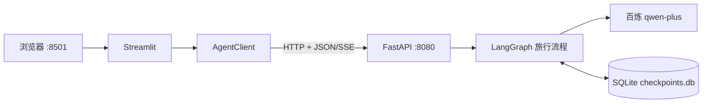
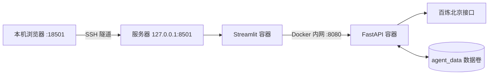
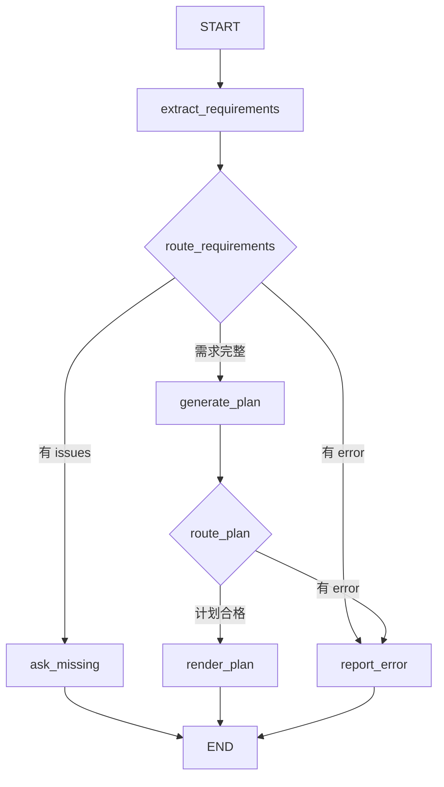

# 三天从零学会旅行规划 Agent

进阶新增能力见 [进阶搭建与源码讲解](ADVANCED.md)，包括地图/MCP、RAG、异步任务、监控与评测。

这是一份针对 Python 和后端初学者的实操手册。目标不是三天背完 LangGraph、FastAPI 和 Docker 的全部 API，而是让你能够独立完成以下事情：

1. 在本机和服务器上启动项目。
2. 说清一条聊天请求经过哪些组件。
3. 看懂并修改旅行 Agent 的核心代码。
4. 解释为什么需要结构化输出、程序校验和会话状态。
5. 演示项目，并诚实回答面试官的追问。

项目已经搭建并验证完成。你现在的重点是沿着真实运行链路学习，而不是重新抄一遍安装命令。

原项目：<https://github.com/JoshuaC215/agent-service-toolkit>

本次开发从上游 commit `fe3b2dcc84d41e6f7f345fd5830f2e12a978c10a` 开始，保留 MIT 许可和原作者归属。

## 目录

- [一、你最终做出了什么](#一你最终做出了什么)
- [二、先记住整个系统的样子](#二先记住整个系统的样子)
- [三、第一天：运行项目并看懂请求链路](#三第一天运行项目并看懂请求链路)
- [四、第二天：逐行理解旅行 Agent](#四第二天逐行理解旅行-agent)
- [五、第三天：测试、部署与面试演示](#五第三天测试部署与面试演示)
- [六、完整多轮对话的状态变化](#六完整多轮对话的状态变化)
- [七、FastAPI、SSE 与客户端详解](#七fastapisse-与客户端详解)
- [八、SQLite 为什么能保存历史](#八sqlite-为什么能保存历史)
- [九、Docker Compose 部署详解](#九docker-compose-部署详解)
- [十、测试代码应该怎样读](#十测试代码应该怎样读)
- [十一、故障排查](#十一故障排查)
- [十二、三分钟演示脚本](#十二三分钟演示脚本)
- [十三、面试高频问题](#十三面试高频问题)
- [十四、简历表述](#十四简历表述)
- [十五、下一版本](#十五下一版本)
- [十六、术语速查](#十六术语速查)

---

## 一、你最终做出了什么

这是一个单城市旅行规划助手。用户提供目的地、天数、每人预算和偏好，系统先提取需求并执行确定性校验；信息不全时追问，信息完整时让百炼 `qwen-plus` 生成结构化日程，然后由 Python 计算费用总额和预算差额。

### 1. 当前已经完成的能力

| 能力 | 实现方式 | 你应该会解释什么 |
| --- | --- | --- |
| 多轮补充需求 | LangGraph 状态 + SQLite checkpointer | 同一个 `thread_id` 如何恢复消息 |
| 结构化需求提取 | Pydantic + 模型 function calling | 为什么不直接解析一段自由文本 |
| 参数校验 | 普通 Python 函数 | 为什么不能只依靠提示词 |
| 条件路由 | LangGraph `add_conditional_edges` | 信息缺失与信息完整走不同节点 |
| 结构化行程 | `TravelPlan` 数据模型 | 如何限制天数、费用和文本长度 |
| 费用核算 | Python 求和 | 如何保证总额与预算差额算术正确 |
| HTTP 服务 | FastAPI | `/invoke`、`/stream`、`/history` 的区别 |
| 流式响应 | SSE | 服务器怎样持续发送事件 |
| 页面 | Streamlit | 页面如何调用后端而不是直接调用模型 |
| 远程部署 | Docker Compose | 网络隔离、数据卷、健康检查、内存限制 |
| 服务鉴权 | Bearer Token | `thread_id` 为什么不能当密码 |

### 2. 当前边界

当前版本支持：

- 一个目的地城市。
- 1～5 个整数天。
- 大于 0 且不超过 100 万元的人民币每人全程预算。
- 自然风景、美食、亲子、节奏等文字偏好。
- 用户说明预算是否包含往返大交通。

当前版本没有接入实时天气、地图 POI、路线、酒店票务、旅行 RAG、Celery、Redis、Prometheus、Grafana，也没有四路独立 Agent 并行推理。

页面中的景点、时间和分类价格是模型给出的参考内容。程序能保证数据结构和加法正确，但不能保证市场价格、营业时间或路线可达性正确。

### 3. 当前验证状态

| 阶段 | 状态 |
| --- | --- |
| 本机 Conda 环境 | 已完成 |
| 百炼 `qwen-plus` 调用 | 已完成 |
| 旅行工作流 | 已完成 |
| 完整自动化测试 | `200 passed, 4 skipped` |
| Ruff 代码检查 | 通过 |
| Docker Compose 远程部署 | 已完成 |
| 后端重启后历史恢复 | 通过 |
| 前端密钥隔离 | 通过 |

---

## 二、先记住整个系统的样子

### 1. 本机开发结构



浏览器不直接请求百炼。前端只认识 FastAPI；FastAPI 再调用 LangGraph；LangGraph 的节点选择是否调用模型。

### 2. 远程部署结构



服务器只把 Streamlit 绑定到 `127.0.0.1:8501`，公网不能直接访问。你通过 SSH 隧道把本机 18501 转发到服务器 8501。

### 3. 最值得先读的文件

不要从整个仓库的第一个文件开始逐行读。按请求链路阅读：

| 顺序 | 文件 | 作用 |
| --- | --- | --- |
| 1 | `src/agents/travel_assistant.py` | 旅行流程，也是面试重点 |
| 2 | `src/agents/agents.py` | 注册并选择 Agent |
| 3 | `src/schema/schema.py` | HTTP 请求和响应结构 |
| 4 | `src/service/service.py` | FastAPI 路由、SSE 和状态恢复 |
| 5 | `src/client/client.py` | Streamlit 调用后端的客户端 |
| 6 | `src/streamlit_app.py` | 页面、会话 ID 和历史显示 |
| 7 | `src/core/llm.py` | 根据配置创建模型客户端 |
| 8 | `src/memory/sqlite.py` | SQLite checkpointer 初始化 |
| 9 | `tests/agents/test_travel_assistant.py` | 业务规则怎样被验证 |
| 10 | `compose.deploy.yaml` | 服务器容器关系 |

---

## 三、第一天：运行项目并看懂请求链路

第一天目标：不用完全理解 LangGraph，也能独立启动项目、调用 API，并画出请求链路。

### 第 1 小时：认识环境

源码位置：

```text
/path/to/agent-service-toolkit
```

Conda 环境名是 `agentroute`。检查环境：

```bash
conda activate agentroute
which python
python --version
```

预期 Python 路径包含 `/opt/anaconda3/envs/agentroute/bin/python`，实际版本为 3.12.14。

#### Conda、Python、pip 和 uv 分别是什么

- Python 是执行代码的解释器。
- Conda 创建隔离环境，让这个项目的包不影响其他项目。
- pip 是 Python 包安装器。
- uv 也是包管理工具，并根据 `uv.lock` 安装固定版本。
- `pyproject.toml` 描述项目依赖。
- `uv.lock` 记录解析出的精确版本和哈希。

当前环境已经安装完成。只有环境损坏时才需要重建：

```bash
conda create -n agentroute python=3.12 pip -y
conda activate agentroute
cd /path/to/agent-service-toolkit
python -m pip install uv==0.11.32
UV_PROJECT_ENVIRONMENT="$CONDA_PREFIX" uv sync --frozen --python "$CONDA_PREFIX/bin/python"
```

`--frozen` 表示严格使用锁文件，不重新选择新版本。

### 第 2 小时：理解环境变量

本机 `.env` 由程序启动时读取。核心配置如下：

```dotenv
DEFAULT_MODEL=openai-compatible
COMPATIBLE_MODEL=qwen-plus
COMPATIBLE_BASE_URL=https://dashscope.aliyuncs.com/compatible-mode/v1
COMPATIBLE_API_KEY=你自己的百炼密钥
USE_FAKE_MODEL=false
DATABASE_TYPE=sqlite
SQLITE_DB_PATH=checkpoints.db
HOST=127.0.0.1
PORT=8080
AGENT_URL=http://127.0.0.1:8080
MODE=dev
LANGCHAIN_TRACING_V2=false
LANGFUSE_TRACING=false
```

| 配置 | 含义 |
| --- | --- |
| `DEFAULT_MODEL` | 项目内部选择哪类模型适配器 |
| `COMPATIBLE_MODEL` | 实际请求百炼的模型名 |
| `COMPATIBLE_BASE_URL` | OpenAI 兼容接口地址 |
| `COMPATIBLE_API_KEY` | 百炼身份凭证 |
| `USE_FAKE_MODEL` | 是否使用测试假模型 |
| `DATABASE_TYPE` | 选择 SQLite 或其他数据库 |
| `SQLITE_DB_PATH` | 本地检查点文件位置 |
| `HOST`、`PORT` | FastAPI 监听地址和端口 |
| `AGENT_URL` | Streamlit 请求后端的地址 |
| `MODE` | 开发模式会启用 Uvicorn 热重载 |

`openai-compatible` 表示百炼提供兼容 OpenAI SDK 请求格式的接口，实际模型仍是 `qwen-plus`。

不要执行 `cat .env` 后把输出贴到聊天、截图或 GitHub。Git 已忽略 `.env`。曾公开过的旧密钥应在百炼控制台撤销。

### 第 3 小时：启动后端和前端


终端 A 启动 FastAPI：

```bash
conda activate agentroute
cd /path/to/agent-service-toolkit
python src/run_service.py
```

终端 B 启动 Streamlit：

```bash
conda activate agentroute
cd /path/to/agent-service-toolkit
python -m streamlit run src/streamlit_app.py \
  --server.address 127.0.0.1 \
  --server.headless true \
  --browser.gatherUsageStats false
```

| 地址 | 用途 |
| --- | --- |
| <http://127.0.0.1:8501> | 本机页面 |
| <http://127.0.0.1:8080/docs> | FastAPI 接口文档 |
| <http://127.0.0.1:8080/health> | 后端健康检查 |
| <http://127.0.0.1:8501/_stcore/health> | Streamlit 健康检查 |

如果服务已经运行，不要再次启动。第二个进程会因端口被占用而失败。关闭网页不会停止后台进程，需要在启动终端按 `Ctrl+C`。

### 第 4 小时：直接调用 API

先看服务元数据：

```bash
curl http://127.0.0.1:8080/info
```

重点看默认值：

```json
{
  "default_agent": "travel-assistant",
  "default_model": "openai-compatible"
}
```

非流式调用：

```bash
curl -X POST http://127.0.0.1:8080/travel-assistant/invoke \
  -H 'Content-Type: application/json' \
  -d '{
    "message": "我想去杭州玩三天",
    "thread_id": "learning-thread-001"
  }'
```

因为缺少预算，返回内容应要求补充预算。

使用相同 `thread_id` 补充信息：

```bash
curl -X POST http://127.0.0.1:8080/travel-assistant/invoke \
  -H 'Content-Type: application/json' \
  -d '{
    "message": "每人1500元，不含往返大交通，喜欢自然风景",
    "thread_id": "learning-thread-001"
  }'
```

这次应返回三天行程。换一个新的 `thread_id`，它就不会知道上一轮的杭州和三天。

查看历史：

```bash
curl -X POST http://127.0.0.1:8080/travel-assistant/history \
  -H 'Content-Type: application/json' \
  -d '{"thread_id":"learning-thread-001"}'
```

正常会有四条消息：用户说杭州三天、助手追问、用户补充预算、助手给出行程。

### 第 5 小时：理解 `/invoke` 和 `/stream`

`/invoke` 等工作流结束后一次返回最终消息，适合调试。

`/stream` 返回 `text/event-stream`，连接建立后持续发送事件：

```text
data: {"type":"message","content":{...}}

data: [DONE]

```

事件之间用空行分隔。`data:` 是 SSE 约定，`[DONE]` 表示发完。

本项目内部的需求提取和结构化计划调用带有 `skip_stream` 标签，因此页面不会显示 function calling 的内部参数，主要看到最终确定性渲染结果。这个 Agent 使用统一 SSE 通道，但内部结构化输出不会逐字暴露。

### 第 6 小时：第一天自检

不看文档回答：

1. 页面直接调用百炼了吗？
2. `AGENT_URL` 给谁使用？
3. 相同 `thread_id` 有什么作用？
4. `/invoke` 与 `/stream` 有什么差别？
5. 为什么 `.env` 不能提交？

合格标准：可以画出“浏览器 → Streamlit → AgentClient → FastAPI → LangGraph → 百炼/SQLite”，并能独立启动两个本机进程。

---

## 四、第二天：逐行理解旅行 Agent

第二天集中学习 `src/agents/travel_assistant.py`。这个文件包含本项目最重要的设计。

### 1. 先看状态图



节点是执行工作的函数，边决定执行顺序，条件边根据状态选择下一步。

### 2. 四个 Pydantic 数据模型

#### `TripRequirements`

```python
class TripRequirements(BaseModel):
    destination: str | None
    days: float | None
    budget: float | None
    preferences: str | None
```

- `class` 定义类。
- `BaseModel` 来自 Pydantic，负责解析和验证数据。
- `str | None` 表示字符串或者未知。
- `float | None` 表示数字或者未知。
- `Field(default=None, description=...)` 提供默认值和给模型看的字段说明。

`days` 先用 `float` 接收，是为了保留用户输入的 2.5 天，再由业务代码明确拒绝。缺失值使用 `None`，因为 `0` 是实际输入但不合法，二者需要不同提示。

#### `DailyPlan`

```python
class DailyPlan(BaseModel):
    day: int = Field(ge=1, le=5)
    morning: str = Field(min_length=1, max_length=300)
    afternoon: str = Field(min_length=1, max_length=300)
    evening: str = Field(min_length=1, max_length=300)
```

`ge` 是大于等于，`le` 是小于等于。日期编号限制在 1～5，三个时段不能为空，也不能无限长。

#### `CostEstimate`

五类费用都限制为非负且不超过 100 万：住宿、餐饮、市内交通、门票活动、其他。

Pydantic 可以阻止模型返回 `-100` 的住宿费，但不能判断某项现实价格是否正确。类型校验与事实核验是两件事。

#### `TravelPlan`

```python
class TravelPlan(BaseModel):
    days: list[DailyPlan]
    costs: CostEstimate
```

最终输出由每日计划列表和费用对象组成。模型不输出总额，总额交给 Python 计算。

### 3. `TravelState` 保存什么

```python
class TravelState(MessagesState, total=False):
    requirements: dict
    issues: list[str]
    plan: dict
    error: str | None
```

`MessagesState` 已带有 `messages` 字段和消息合并规则。节点返回新消息时，LangGraph 会追加历史，而不是覆盖历史。

| 字段 | 示例 | 用途 |
| --- | --- | --- |
| `messages` | HumanMessage、AIMessage | 多轮聊天内容 |
| `requirements` | `{"destination":"杭州",...}` | 已提取需求 |
| `issues` | `["请提供预算"]` | 确定性校验问题 |
| `plan` | 每日计划和分类费用 | 结构化模型结果 |
| `error` | 错误提示或 `None` | 模型/解析失败的路由标志 |

`total=False` 表示额外键不必在每个中间状态同时存在，刚开始时还没有 `plan`。

### 4. `validate_requirements` 为什么用普通 Python

这个函数完全不调用模型：

```python
def validate_requirements(trip: TripRequirements) -> list[str]:
    issues = []
    # 检查目的地、天数、预算
    return issues
```

它检查目的地非空、天数存在且为 1～5 的整数、预算存在且位于合法范围。提示词只能要求模型遵守规则，Python 条件判断才是确定性的，也更容易测试。

| 输入 | `issues` |
| --- | --- |
| 杭州、3 天、未给预算 | 缺少预算 |
| 杭州、2.5 天、1500 元 | 天数必须是 1～5 的整数 |
| 杭州、0 天、-100 元 | 天数错误和预算错误 |
| 杭州、3 天、1500 元 | 空列表，可以继续生成 |

### 5. `selected_model` 如何选模型

```python
def selected_model(config: RunnableConfig):
    return get_model(
        config.get("configurable", {}).get("model", settings.DEFAULT_MODEL)
    )
```

优先读取本次请求传入的模型，没有传入时使用 `.env` 的 `DEFAULT_MODEL`。当前适配器是 `openai-compatible`，它再用兼容接口配置创建百炼客户端。

### 6. `extract_requirements` 的六步过程

#### 第一步：只保留用户消息

```python
user_messages = [m for m in state["messages"] if isinstance(m, HumanMessage)]
```

这是列表推导式。只读取 `HumanMessage` 可以防止助手追问时举例的数字被误认为用户要求。

#### 第二步：构造系统指令

系统指令要求只提取用户明确的信息，按时间顺序合并，最新更正覆盖旧值，缺失字段用 `null`，并保留零、负数和小数供程序校验。

#### 第三步：要求结构化输出

```python
selected_model(config).with_structured_output(
    TripRequirements,
    method="function_calling",
)
```

模型以工具参数格式返回符合 `TripRequirements` 的对象。它不是调用地图工具，也不是多 Agent，只是把自然语言转换为字段。

#### 第四步：隐藏内部流

```python
.with_config(tags=["skip_stream"])
```

服务层不会把内部 token 和工具参数推到页面，用户只看到业务回答。

#### 第五步：设置超时

```python
await asyncio.wait_for(..., timeout=45)
```

`async def` 定义异步函数。`await` 让当前协程在等待网络时把执行机会让给事件循环。它不会让模型更快，但不会把等待时间全部浪费在阻塞上。`wait_for` 把提取阶段限制为 45 秒。

#### 第六步：返回部分状态

成功时返回：

```python
{
    "requirements": trip.model_dump(),
    "issues": validate_requirements(trip),
    "error": None,
}
```

LangGraph 节点只需返回它修改的字段。失败时返回统一错误提示，日志只记录异常类型，减少凭证或用户数据进入日志的风险。

### 7. `route_requirements` 如何做条件路由

```python
if state.get("error"):
    return "report_error"
return "ask_missing" if state["issues"] else "generate_plan"
```

有错误进入 `report_error`；没有错误但有校验问题进入 `ask_missing`；需求完整进入 `generate_plan`。返回值是下一个节点名，不是给用户看的回答。

### 8. `ask_missing` 为什么不调用模型

缺什么已经由 Python 确定，不必再调用一次模型。节点用固定模板展示已知字段和问题，延迟更低，也不会突然追问无关信息。

该节点结束本轮请求。用户补充预算时发起新请求，由相同 `thread_id` 恢复历史，再从提取节点开始。

当前没有使用 LangGraph `interrupt()` 暂停一次图运行。要能区分“结束本轮后开始下一轮”和“恢复同一次被中断的运行”。

### 9. `generate_plan` 怎样生成行程

节点把整理后的需求作为 JSON 交给模型：

```json
{
  "destination": "杭州",
  "days": 3.0,
  "budget": 1500.0,
  "preferences": "不含往返大交通，喜欢自然风景"
}
```

模型生成每日三个时段和五类费用。Pydantic 验证后，代码继续检查：

```python
if [day.day for day in plan.days] != list(range(1, expected_days + 1)):
    raise ValueError(...)

if expected_days == 1 and plan.costs.accommodation != 0:
    raise ValueError(...)
```

第一项保证日期数量和编号完全匹配；第二项保证一日游住宿为零。这些是跨字段业务规则，不能只靠单字段范围。

生成阶段限时 60 秒。失败后写入 `error`，由 `route_plan` 转向错误节点。

### 10. `render_plan` 为什么是核心设计

模型返回分类费用，Python 计算：

```python
total = accommodation + food + local_transport + tickets + other
difference = budget - total
```

代码根据差额正负显示预算剩余或超支。住宿晚数也由程序计算：

```python
lodging_nights = max(days - 1, 0)
```

这样解决算术自洽问题。模型仍可能估错现实价格，但不会出现分类费用合计 1300 元、总额却写 1100 元。

`money` 负责金额格式。`render_plan` 最终返回 `AIMessage`，由 `MessagesState` 追加到历史。

### 11. 状态图如何注册

```python
builder = StateGraph(TravelState)
builder.add_node("extract_requirements", extract_requirements)
builder.add_node("ask_missing", ask_missing)
builder.add_node("generate_plan", generate_plan)
builder.add_node("render_plan", render_plan)
builder.add_node("report_error", report_error)
```

添加普通边和条件边后，`builder.compile()` 得到可执行图。FastAPI 服务启动时再把 SQLite checkpointer 挂到图上。

### 12. 第二天动手练习

#### 练习 A：把最大天数改为 7

至少要同步考虑 `validate_requirements`、`DailyPlan.day`、`TravelPlan.days`、提示文本和测试。只改 Prompt 不完整。

#### 练习 B：增加交通偏好

给 `TripRequirements` 增加：

```python
transport_preference: str | None
```

然后修改提取提示、生成提示和渲染。字段不是必填时，不要加入 `issues`。

#### 练习 C：解释错误路径

百炼返回两天计划、用户要求三天时：日期序列检查抛错，`except` 写入 `error`，`route_plan` 进入 `report_error`，用户看到统一提示，已有对话仍保留。

### 13. 第二天自检

你应该能解释：`days` 为什么用浮点数、为什么只读取用户消息、为什么追问不用模型、为什么总额由 Python 计算。

---

## 五、第三天：测试、部署与面试演示

第三天目标：证明项目不是“页面能开就算完成”，并能说明部署取舍。

### 第 1～2 小时：运行测试

```bash
conda activate agentroute
cd /path/to/agent-service-toolkit
python -m pytest tests/agents/test_travel_assistant.py -q
python -m pytest -q
ruff check .
```

当前结果：

```text
200 passed, 4 skipped, 38 warnings
All checks passed!
```

四个跳过项需要额外 Docker 参数。38 条 warning 主要是上游依赖弃用提示，不是旅行 Agent 失败。

### 第 3 小时：理解测试边界

自动化测试验证缺失追问、多轮累计、会话隔离、非法参数、错误天数、一日游住宿、费用计算和模型失败。

假模型测试不能证明百炼账号有额度、网络稳定、模型理解所有中文或景点价格真实。因此又执行了真实百炼冒烟测试。两类测试解决不同问题。

### 第 4 小时：理解部署

`compose.deploy.yaml` 包含 `agent_service` 和 `streamlit_app`。服务器目录为 `/opt/agentroute`。

服务器约 1.6 GiB 内存且没有 swap，只部署这两个服务。重启后实测后端约 575 MiB、前端约 51 MiB；限制分别是 768 MiB 和 384 MiB。

### 第 5 小时：完成一次演示

1. Settings 确认 `travel-assistant`。
2. 新建会话并输入“杭州三天”。
3. 看到预算追问。
4. 补充“每人1500元，不含往返大交通，喜欢自然风景”。
5. 检查正好三天、住宿默认两晚、费用总额。
6. 输入“改成0天，预算-100元”。
7. 检查返回两个校验问题，不生成行程。

### 第 6 小时：练习表达

先用三分钟讲，再压缩成一分钟，最后只回答追问。合格标准是能启动远程隧道、演示两轮对话、指出核心文件，并回答“为什么不用一个大 Prompt”。

---

## 六、完整多轮对话的状态变化

### 第一轮：“我想去杭州玩三天”

FastAPI 包装为 `HumanMessage`，初始状态只有消息。提取后：

```python
{
    "requirements": {
        "destination": "杭州",
        "days": 3.0,
        "budget": None,
        "preferences": None,
    },
    "issues": ["请提供人民币每人全程预算，并说明是否包含往返大交通。"],
    "error": None,
}
```

因为 `issues` 非空，进入 `ask_missing`。本轮结束时有两条消息，检查点使用 `thread_id` 保存状态。

### 第二轮：补充预算

```text
每人1500元，不含往返大交通，喜欢自然风景。
```

服务用相同 `thread_id` 恢复原状态，追加用户消息。提取节点只取两条用户消息并综合：

```python
{
    "destination": "杭州",
    "days": 3.0,
    "budget": 1500.0,
    "preferences": "不含往返大交通，喜欢自然风景",
}
```

`issues` 为空，流程进入生成和渲染，追加第四条消息。

### 用户更正信息

输入“改成四天，预算1800元”时，提取提示要求最新明确更正覆盖旧值。自然语言理解由模型完成，程序随后检查四天是否合法。

### 为什么新会话没有旧预算

检查点按 `thread_id` 区分。新的 ID 对应新状态。恢复历史还要使用创建该历史的 Agent，页面会把 `agent` 写入分享链接。

---

## 七、FastAPI、SSE 与客户端详解

### 1. 启动与 lifespan

`src/run_service.py` 读取 `.env`、配置日志，然后让 Uvicorn 启动 `service:app`。

FastAPI 的 `lifespan` 在启动期间初始化数据库 checkpointer 和 store，创建表，加载 Agent，并把存储对象挂到每个图上。服务关闭时异步上下文管理器释放连接。

### 2. 鉴权

远程 `.env.deploy` 配置 `AUTH_SECRET`。请求需要携带：

```text
Authorization: Bearer <服务密钥>
```

`verify_bearer` 不匹配时返回 401。Streamlit 容器持有服务密钥，百炼 API Key 只在后端。`thread_id` 是索引，不是身份凭证。

### 3. `/info`

返回可选 Agent、模型和默认值。Streamlit 用它生成 Settings 下拉框。

### 4. `_handle_input`

每次请求会创建 `run_id`，读取或生成 `thread_id` 和 `user_id`，组成 LangGraph `RunnableConfig`，查询是否有 interrupt，普通输入则包装为 `HumanMessage`。

```python
{
    "configurable": {
        "thread_id": "learning-thread-001",
        "user_id": "某个用户编号",
        "model": "openai-compatible",
    }
}
```

### 5. `/invoke`

调用 `agent.ainvoke`，等待图完成，从最终状态取最后一条消息并转换为 API 的 `ChatMessage`。适合命令行调试和只关心最终结果的调用。

### 6. `/stream`

`message_generator` 使用 `agent.astream` 读取 LangGraph 事件，转换为三类 SSE：

| 类型 | 含义 |
| --- | --- |
| `token` | 模型文本片段 |
| `message` | 完整聊天消息 |
| `error` | 流内错误 |

服务丢弃 LangGraph 重发的原始用户消息，避免页面重复显示；跳过带 `skip_stream` 标签的事件；最后发送 `[DONE]`。

### 7. `AgentClient`

`src/client/client.py` 保存后端地址，从环境读取服务密钥，请求 `/info` 并选择默认 Agent。

调用 `stream()` 时：构造 `StreamInput`、POST 到 `/{agent}/stream`、逐行读取、去掉 SSE 的 `data:` 前缀、解析 JSON、转换成 `ChatMessage` 或 token，读到 `[DONE]` 后结束。

### 8. HTTP 数据模型

| 字段 | 是否必填 | 含义 |
| --- | --- | --- |
| `message` | 是 | 用户文本 |
| `model` | 否 | 覆盖默认模型 |
| `thread_id` | 否 | 继续同一会话 |
| `user_id` | 否 | 区分用户和列出线程 |
| `agent_config` | 否 | Agent 自定义配置 |
| `stream_tokens` | 流接口可选 | 是否返回 token 事件 |

`ChatMessage` 包含角色、内容、工具调用、`run_id` 和响应元数据。

---

## 八、SQLite 为什么能保存历史

大模型接口不会自动记住上一次请求。程序保存旧状态，并在下一轮重新提供上下文。

LangGraph checkpointer 按 `thread_id` 保存图状态，包括消息和业务字段。本机文件是 `checkpoints.db`。服务器文件位于容器 `/data/checkpoints.db`，`/data` 映射到 named volume `agent_data`。

| 组件 | 范围 | 当前实现 |
| --- | --- | --- |
| checkpointer | 同一线程的状态和短期聊天记忆 | SQLite 持久化 |
| store | 跨线程长期记忆 | SQLite 模式下使用内存实现 |

因此当前证明的是同一线程持久化，不是完整的跨会话用户画像。

历史消失的常见原因包括 `thread_id` 改变、使用不同 Agent、数据库路径改变、容器没挂载数据卷或页面缓存旧连接。

线上验收先生成四条消息，随后重启后端，再用同一 `thread_id` 查询。重启后仍返回四条消息，证明数据不只在进程内存中。

---

## 九、Docker Compose 部署详解

### 1. 两个镜像

后端需要 LangGraph、模型 SDK 和数据库；前端只需要 Streamlit、HTTP 客户端和 schema。分开后能隔离凭证并单独重启。

### 2. 后端配置

- 从 `docker/Dockerfile.service` 构建。
- 读取 `.env.deploy`。
- `expose: 8080` 只开放 Docker 内网。
- `agent_data` 挂载到 `/data`。
- 内存限制 768 MiB。
- 定期请求 `/health`。
- `restart: unless-stopped`。

### 3. 前端配置

- 从 `docker/Dockerfile.app` 构建。
- 通过 `http://agent_service:8080` 访问后端。
- 只接收 `AUTH_SECRET`，不接收百炼 Key。
- 主机映射为 `127.0.0.1:8501:8501`。
- 等后端健康后启动。
- 内存限制 384 MiB。

Compose 服务名是内部 DNS 名，因此无需知道容器 IP。

### 4. 锁文件与构建源

Dockerfile 先用 `uv export --frozen` 从锁文件导出固定依赖，再用 `uv --no-config pip install --require-hashes` 安装。服务器用清华镜像下载，但版本由锁文件决定，哈希仍校验。

### 5. 常用服务器命令

```bash
export SERVER_IP="your-server-ip"
ssh root@"$SERVER_IP"
cd /opt/agentroute
docker compose --env-file .env.deploy -f compose.deploy.yaml ps
docker compose --env-file .env.deploy -f compose.deploy.yaml logs --tail=100 agent_service
docker stats --no-stream
free -h
```

构建和启动：

```bash
COMPOSE_PARALLEL_LIMIT=1 docker compose \
  --env-file .env.deploy -f compose.deploy.yaml build

docker compose \
  --env-file .env.deploy -f compose.deploy.yaml \
  up -d --wait --wait-timeout 240
```

停止但保留数据：

```bash
docker compose --env-file .env.deploy -f compose.deploy.yaml stop
```

不要执行 `docker compose down -v`，`-v` 会删除 SQLite 数据卷。

### 6. 访问远程页面

本机终端保持运行：

```bash
ssh -N -o ExitOnForwardFailure=yes \
  -L 127.0.0.1:18501:127.0.0.1:8501 \
  root@"$SERVER_IP"
```

打开 <http://127.0.0.1:18501>。`-N` 表示只转发，不打开远程 shell，所以终端没有提示符是正常的。`Ctrl+C` 只关闭隧道，不停止容器。

当前用 SSH 保护个人演示。公开网站需要域名、HTTPS、登录、限流和成本控制，不能简单把 8501 暴露到公网。

---

## 十、测试代码应该怎样读

测试文件是 `tests/agents/test_travel_assistant.py`。自动化测试使用固定响应的假模型，避免网络、余额和随机性。

测试通常分为：

```text
Arrange：准备图、假模型、thread_id 和输入
Act：调用 ainvoke
Assert：断言消息、路由或费用文本
```

重点场景：

- 缺少预算时追问，规划器不应被调用。
- 相同线程两轮补充后生成计划。
- 两个线程互不读取对方预算。
- 零天、小数天、负预算、超大预算被拒绝。
- 模型返回错误天数时进入错误分支。
- 一日游返回住宿费时被拒绝。
- 固定分类费用得到正确总额和差额。
- 模型异常时返回可读提示。

失败时先看第一处 `FAILED`，不要先处理 warning。测试名说明场景，traceback 底部通常最接近业务错误。

只运行一个测试：

```bash
python -m pytest \
  tests/agents/test_travel_assistant.py::具体测试函数名 \
  -q
```

---

## 十一、故障排查

按从外到内顺序排查，避免页面无回复就修改 Prompt。

### 页面打不开

```bash
curl http://127.0.0.1:8501/_stcore/health
curl http://127.0.0.1:18501/_stcore/health
```

返回 `ok` 说明前端可访问。连接拒绝通常是前端没启动或隧道没建立。

### 页面打开但没有回复

1. Settings 是否选择 `travel-assistant`。
2. 后端 `/health` 是否正常。
3. 后端终端或 Docker 日志最后 100 行。
4. 百炼接口是否超时、账号是否有额度。
5. 页面是否使用正确 `AGENT_URL`。

### 历史没有出现

检查 URL 中 `thread_id` 是否变化、Agent 是否一致。服务器检查数据卷：

```bash
docker volume ls | grep agent_data
```

### 401 Unauthorized

远程后端启用了 Bearer 鉴权。确认调用方携带正确请求头。不要把真实密钥写进命令历史、截图或文档。

### 端口被占用

```bash
lsof -nP -iTCP:8080 -sTCP:LISTEN
lsof -nP -iTCP:8501 -sTCP:LISTEN
lsof -nP -iTCP:18501 -sTCP:LISTEN
```

先确认现有监听是否就是需要的服务，不要重复启动。

### 修改后没生效

确认文件保存；本机看 Uvicorn 是否重载；Docker 需要重新 build；页面可能缓存 `/info`；确认改的是当前 Agent。

### `IndentationError`

```bash
python -m py_compile src/agents/travel_assistant.py
```

Python 用缩进表示代码块，函数体通常四个空格。

### 生成失败

可能是超时、模型结构不符合 Pydantic、天数不匹配、一日游住宿不为零、配额或网络错误。当前日志记录异常类型；深入排查时应增加不含凭证和隐私的结构化日志。

### Docker 构建慢或内存不足

服务器较小，使用 `COMPOSE_PARALLEL_LIMIT=1` 串行构建，避免两个镜像同时达到内存高峰。

---

## 十二、三分钟演示脚本

### 0～30 秒：问题与方案

> 这是我基于 agent-service-toolkit 二次开发的旅行规划助手。我主要解决用户需求经常一次说不全，以及模型生成费用容易结构和加法不一致的问题。

### 30～90 秒：条件路由

输入“杭州三天”。页面追问后说明：

> 第一节点先结构化提取目的地、天数、预算和偏好；Python 检查出预算缺失，LangGraph 路由到确定性追问，没有增加一次额外模型调用。

补充“每人1500元，不含往返大交通，喜欢自然风景”。

### 90～140 秒：结果校验

> 模型只生成结构化日程和分类估价，总额与差额由 Python 计算。代码还检查日期序列和一日游住宿费，防止结构合法但业务不一致的结果进入页面。

### 140～180 秒：工程实现

> FastAPI 提供 invoke、SSE stream 和 history；SQLite checkpointer 按 thread_id 保存多轮状态；Docker Compose 部署前后端，后端只在容器内网开放。我验证了鉴权、密钥隔离和重启后的历史恢复。

最后说明当前没有地图、天气或实时价格工具，结果是参考行程；下一版优先接入真实工具并设计降级。

---

## 十三、面试高频问题

### 1. 为什么不用一个大 Prompt？

需求补全、范围校验、生成和算术的可靠性要求不同。语言理解交给模型，明确规则和计算交给 Python，LangGraph 负责组合与路由，便于测试和定位失败。

### 2. 这算多 Agent 吗？

当前是一个含多个节点的 Agent 工作流，没有四个独立 Agent 并行协作，因此不会宣传为多 Agent。

### 3. LangGraph 解决什么？

提供显式状态、节点、条件路由和检查点。需求缺失、生成成功、模型失败走不同路径，多轮消息由状态管理。

### 4. 结构化输出能消除幻觉吗？

不能。它约束字段和类型，不证明内容符合现实。动态事实仍需真实工具或来源。

### 5. 为什么 Pydantic 后还要 Python 校验？

Pydantic 适合类型和单字段范围。计划天数必须匹配需求、一日游住宿为零属于跨字段业务规则。

### 6. 多轮记忆怎样实现？

`thread_id` 放入 LangGraph 配置，SQLite checkpointer 按它保存和恢复状态。模型没有永久记忆，是程序重新提供上下文。

### 7. 为什么只把 HumanMessage 交给提取器？

防止助手追问中的示例数字被误当成用户要求。需求只来自用户明确表达。

### 8. SSE 与 WebSocket 有何区别？

SSE 是服务器到客户端的单向 HTTP 事件流，适合推送模型输出；WebSocket 是双向长连接。本项目输入用 POST、输出用 SSE 已足够。

### 9. `async/await` 有什么用？

模型和数据库大部分时间在等待 I/O。异步允许事件循环处理其他协程，提高 I/O 场景资源利用率；它不会减少模型推理时间。

### 10. 如何处理超时？

提取限时 45 秒，生成限时 60 秒，失败转换为可读提示并保留历史。当前尚未按限流、认证、超时分类重试。

### 11. 如何保证费用正确？

保证分类费用总和和预算差额由 Python 计算，算术一致。分类估价仍来自模型，不能保证符合实时市场。

### 12. 为什么用 SQLite？

单机学习项目需要低运维成本，数据卷可保证重启后保留。多实例或更高并发时再评估 PostgreSQL。

### 13. 如何证明持久化？

先生成四条消息并查询历史，重启后端，再用相同 `thread_id` 查询，仍返回四条。

### 14. 如何保护密钥？

`.env.deploy` 权限为 600 且不提交 Git。百炼 Key 只进后端，前端只有服务密钥。后端不映射公网，页面通过 SSH 隧道访问。

### 15. 流量增加怎样扩展？

先压测定位瓶颈。长任务可交给 Celery，Redis 保存队列状态，多实例下改 PostgreSQL，再补限流和指标。当前小服务器不适合硬塞整套组件。

### 16. 你改了开源项目哪些部分？

新增旅行 StateGraph、Pydantic 模型、确定性校验和费用渲染；注册默认 Agent；补充业务测试、远程 Compose、验收脚本和学习文档。通用服务、客户端和页面主体来自上游。

### 17. 最大不足是什么？

动态事实缺少可靠来源。最有价值的改进是接入地图或天气工具，记录来源和时间，并为工具失败设计可验证降级。

---

## 十四、简历表述

### 旅行规划 Agent｜个人学习项目

技术栈：Python、LangGraph、LangChain、FastAPI、Streamlit、SQLite、Docker Compose、阿里云百炼

> 基于开源 agent-service-toolkit 二次开发单城市旅行规划助手，使用 LangGraph StateGraph 编排需求提取、参数校验、缺失追问、结构化行程生成和结果渲染；通过 Pydantic 与 Python 规则限制 1～5 天、预算范围、日期序列及一日游住宿费用，由程序统一计算五类费用总额和预算差额。复用 FastAPI SSE 接口与 SQLite checkpointer 实现多轮对话，补充会话隔离、非法参数、模型失败和结果一致性测试；使用 Docker Compose 部署前后端，通过数据卷持久化会话、Bearer Token 完成服务鉴权，并验证容器重启后的历史恢复。

一分钟介绍：

> 我基于 MIT 开源 Agent 服务框架做了旅行场景二次开发。用户第一次只说“杭州三天”时，模型结构化提取需求，Python 发现预算缺失后由 LangGraph 路由到追问；同一线程补充预算后再进入结构化规划。模型负责语言理解和内容生成，Python 负责天数、预算、日期序列和费用总额。后端用 FastAPI 提供 SSE，SQLite 保存状态，最后用 Docker Compose 部署并验证鉴权与重启恢复。

当前不能写四路多 Agent、高德 MCP、实时数据、RAG、Celery + Redis、Prometheus/Grafana、未测量的 P95 或吞吐量。

---

## 十五、下一版本

一次只新增一条真实能力，并补测试和失败处理。

### 1. 天气工具

流程变成“需求完整 → 查询天气 → 生成行程”。处理预报日期范围、超时降级，并标明数据时间和来源。

### 2. 地图地理编码和 POI

把地点变成真实 POI 和坐标，验证城市、存在性和缺失坐标，设计主备接口。

### 3. 路线可达性

计算地点间耗时，检查行程是否过密，把文本日程升级为带坐标和时间的对象。

### 4. 小型评测集

准备 20～50 条固定需求，测必填提取准确率、追问命中率、天数完整率、预算算术一致率、偏好覆盖率和来源覆盖率。

### 5. 异步任务和监控

规划链路明显变长后再引入 Celery、Redis 和监控。当前服务器没有足够内存稳妥运行整套服务。

---

## 十六、术语速查

| 术语 | 简单解释 | 本项目例子 |
| --- | --- | --- |
| Agent | 根据状态和规则选择下一步的模型应用 | `travel-assistant` |
| Node | 图中执行工作的函数 | `extract_requirements` |
| Edge | 节点连接 | 提取后进入路由 |
| Conditional Edge | 根据状态选择连接 | 有 issues 时追问 |
| State | 运行中的数据 | messages、requirements、plan |
| Checkpoint | 保存的状态快照 | SQLite 线程状态 |
| `thread_id` | 一段对话标识 | 两轮补充使用同一值 |
| `user_id` | 用户标识 | 页面列出该用户线程 |
| Pydantic | 数据解析和校验库 | `TravelPlan` |
| Structured Output | 让模型按字段返回 | 目的地和预算提取 |
| Function Calling | 模型以工具参数格式返回结构 | 解析 Pydantic 对象 |
| FastAPI | Python Web API 框架 | `/stream` |
| Uvicorn | ASGI 应用服务器 | 启动 `service:app` |
| SSE | 服务器单向推送文本事件 | 行程流接口 |
| Async | 等 I/O 时运行其他协程 | `await planner.ainvoke` |
| SQLite | 单文件关系数据库 | `checkpoints.db` |
| Docker image | 程序和依赖模板 | 前后端镜像 |
| Docker container | 镜像运行实例 | 两个健康容器 |
| Volume | 独立于容器的数据空间 | `agent_data` |
| Bearer Token | HTTP 访问凭证 | `AUTH_SECRET` |
| RAG | 生成前检索知识证据 | 当前未实现 |
| MCP | 模型连接外部工具的协议 | 当前未接地图 MCP |

## 学习方法

每读一个函数，立刻预测它的输入、输出和下一节点，再在页面或测试中验证：

```text
阅读一个函数 → 预测分支 → 执行 → 对照结果 → 用自己的话解释
```

你可以直接向我提问：

- “逐行解释 `extract_requirements`。”
- “为什么使用 `asyncio.wait_for`？”
- “带我改成最多七天并补测试。”
- “模拟面试官追问这个项目。”
- “带我从浏览器请求跟到 SQLite。”
- “下一步接天气工具，先讲设计再让我写。”

服务器的详细部署记录和运维命令在 `docs/learning/DEPLOYMENT.md`。
